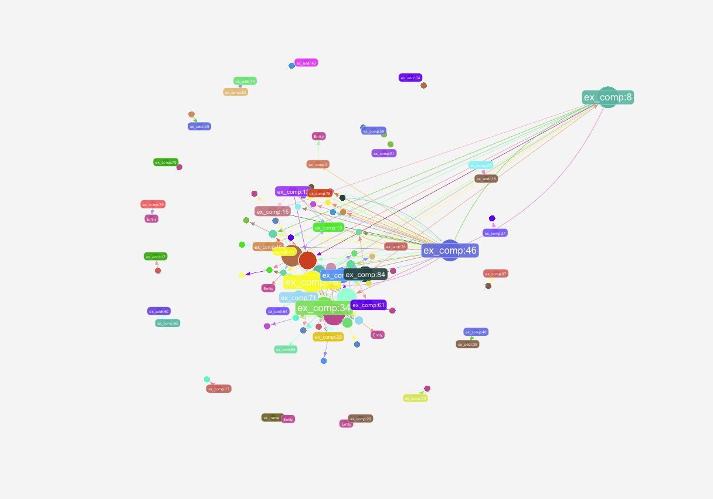

```
  ,-.       _,---._ __  / \
 /  )    .-'       `./ /   \
(  (   ,'            `/    /|
 \  `-"             \'\   / |
  `.              ,  \ \ /  |
   /`.          ,'-`----Y   |
  (            ;        |   '
  |  ,-.    ,-'         |  /
  |  | (   |            | /
  )  |  \  `.___________|/
  `--'   `--'
```

While Neo4j is fun, it's pricing isnt. But fortunately Open Souce is and hence this repo is used to setup a local Janus Graph DB, populate it with company data that can optionally be augmented by syntetically generated data
--

# How to use Janus Graph DB 


## Setup (Dockerized) 

Starting out be fetching and running the latest janusgraph container 

```
$ docker run -it -p 8182:8182 janusgraph/janusgraph
```

I noticed some issues when scanning the container using `grypher`. Those issues can be found in the `vulnerabilites.txt` for further assessment. 


## Communication with the DB

You can simply start another container, that sets up a gremlin console as a client via: 

```

docker build -f ./Dockerfile-gremlin-console -t gremlin-console:3.2.5 --build-arg tinkerpopVersion=3.2.5 [--build-arg https_proxy=$https_proxy] .
```


```
docker run --rm --link janusgraph-default:janusgraph -e GREMLIN_REMOTE_HOSTS=janusgraph \
    -it janusgraph/janusgraph:latest ./bin/gremlin.sh
```

In case you're extra curious, you can play around with it, using the [Tinkerpop Tutorial](https://tinkerpop.apache.org/docs/3.7.3/tutorials/getting-started/).

Alternatively you can also use GUI Tools like 
- [G.V()](https://gdotv.com/)


## Inserting our testdataset
To insert our company dataset, I've built a small script that takes a *.ttl/ *.RDF File as Input  and inserts it into a local Janus Graph Instance that is available at `http://127.0.0.1:8182` (which is what happens by default wen you set up a local docker container as explained above)

You then only have to install all requirements that can be found in the `requirements.txt`.
After that you can use to populate the graph with the original test data via `RDF_Insert_Janus.ipynb`. Just keep in mind that last section (adding ownership) adds augmentations / artifically generated data to simulate a more realistic usecase.


If everything worked correctly, your graph should look something like the following: 



Note: For future notice: The labels of the vertexes will be changed to the company names/adresses/employee names - but do to time constraints, I was not able to do this for now :) 


## Quering our testdata
After successfully populating the graph with our testdata, queries can directly be executed to fetch data from the graph. Up to now, I have experiemented with two different approaches: 
- Python 
- Gremlin 

For simplicity, I stick to gremlin for now. Quering the graph(s) with gremlin can be done directly trough a gremlin console, as discribed above, or through a GUI Tool like G.V(). 
I'd have tried and succedded with both, but prefered G.V(). as it provides innate tools for graph exploration and already visualizes it. 


Additionally, gremlin commands can also be exectute/communicated via python, but for now, i have not tested this approach. 


For our testdata, I would advice to use the G.V() Exploration tool. Alterantively the following queries return all data that is stored in the graph. As we use a small dataset for testing, running those commands should not cause any issues. 


#### Fetching all nodes/vertices
```gremlin
g.V()
```

This should yield something like: 

```json
[ {
  "id" : 552992,
  "label" : "Entity",
  "properties" : {
    "hasPLZ" : "20095",
    "hasCity" : "Hamburg.",
    "hasStreet" : "Domstraße 19",
    "uri" : "ex_addr:63"
  }
}, {
  "id" : 557088,
  "label" : "ex_comp:62",
  "properties" : {
    "hasName" : "LuMa Projektentwicklungs-GmbH",
    "hasFNR" : "H1101_H1101_HRB33484",
    "uri" : "ex_comp:62"
  }
},
...
```

#### Fetch nodes with a specific label
```gremlin
g.V().hasLabel('person').valueMap(True)
```


#### Fetching all edges
```gremlin
g.E()
```
This should yield something like: 

```json
[ {
  "label" : "hasAddress",
  "id" : "f75w-bxuo-5jp-bofc",
  "properties" : { },
  "outVertexId" : 557088,
  "inVertexId" : 544872
}, {
  "label" : "hasAddress",
  "id" : "frb8-c7c0-5jp-dfnc",
  "properties" : { },
  "outVertexId" : 569376,
  "inVertexId" : 626808
}, {
  "label" : "weighted_connection",
  "id" : "gkjo-cahs-4t1x-d660",
  "properties" : {
    "weight" : 0.07
  },
...
```


#### Delete everything in the graph 
```gremlin
g.V().drop().iterate()
```


Have fun :) 


---
# General notes


## Populate Janus with RDF
For this purpose, I found many suitable approaches. Due to the project requirements, I sticked to a simple Bulk-Load. 

#### General Bulk Loading
  - Preprocessing RDF Data: Convert RDF data (e.g., Turtle or RDF/JSON) into a format compatible with JanusGraph, such as CSV or JSON.

  - Enable Batch Loading: Set storage.batch-loading=true in the configuration file to optimize bulk loading performance.

  - Parallelization: Use Hadoop-Gremlin or other parallelization techniques to load large datasets efficiently.

  - Load Vertices and Edges Separately: First load vertex data, followed by edge data, ensuring consistency between IDs.


The simplest way to load a given raw file into JanusGraph is the following Groovy Script: 

```Groovy
graph = TinkerGraph.open()
graph.createIndex('userId', Vertex.class) //1

g = traversal().withEmbedded(graph)

getOrCreate = { id ->
  g.V().has('user','userId', id).
    fold().
    coalesce(unfold(),
             addV('user').property('userId', id)).next()  //2
}

new File('wiki-Vote.txt').eachLine {
  if (!it.startsWith("#")){
    (fromVertex, toVertex) = it.split('\t').collect(getOrCreate) //3
    g.addE('votesFor').from(fromVertex).to(toVertex).iterate()
  }
}

```


Alternatively, one could also work directly with Python: 


```python
v1 = g.addV('person').property('name','marko').next()
v2 = g.addV('person').property('name','stephen').next()
g.V(v1).addE('knows').to(v2).property('weight',0.75).iterate()
```

or 

```python
import csv

with open('data.csv') as file:
    reader = csv.DictReader(file)
    for row in reader:
        g.addV(row['label']).property('name', row['name']).property('age', int(row['age'])).next()
```

### Indexing
By default  Graph indices are automatically chosen by JanusGraph to answer which ask for all vertices $(g.V)$ or all edges $(g.E)$ that satisfy one or multiple constraints (e.g. has or interval).


# Quering Fun! 

# === Gremlin-Python Example Queries for JanusGraph ===

# 1. All companies in "IT" with equity ratio > 0.5

```python
high_equity_companies = (
    g.V().hasLabel('Firma')
    .has('Gewerbezweig', 'IT')
    .has('Dummy_Eigenkapitalquote', gt(0.5))
    .valueMap()
    .toList()
)
```

# 2. People who work as CEO and their companies
```
ceos = (
    g.V().hasLabel('Person')
    .outE('arbeitet_bei').has('Funktion', 'CEO')
    .inV().valueMap('Firmenname')
    .toList()
)
```
# 3. Addresses used by more than one company
```
shared_addresses = (
    g.V().hasLabel('Adresse')
    .in_('hat_adresse')
    .groupCount().by(__.valueMap('Ort', 'Straße'))
    .unfold().filter(__.select(values).is_(gt(1)))
    .select(keys)
    .toList()
)
```

# 4. Total ownership percentage for a company with FNR="123"
```
total_ownership = (
    g.V().has('Firma', 'FNR', '123')
    .inE('beteiligt_an').values('Prozent')
    .sum()
    .next()
)
print(f"Total ownership: {total_ownership}%")
```

# 5. Indirect ownership chains starting from FNR="A"
```
chain = (
    g.V().has('Firma', 'FNR', 'A')
    .repeat(__.out('beteiligt_an')).times(2)
    .emit().path().by('FNR')
    .toList()
)
```

# 6. Employees and their roles for company FNR="456"
```
employees = (
    g.V().has('Firma', 'FNR', '456')
    .in_('arbeitet_bei')
    .project('Name', 'Role')
      .by(__.values('Name'))
      .by(__.inE('arbeitet_bei').values('Funktion'))
    .toList()
)
```
# 7. Companies without an address
```
no_address = (
    g.V().hasLabel('Firma')
    .not_(__.out('hat_adresse'))
    .valueMap('Firmenname', 'FNR')
    .toList()
)
```
# 8. Companies that (directly or indirectly) own themselves
```
loops = (
    g.V().hasLabel('Firma')
    .where(__.out('beteiligt_an').loops().is_(1))
    .valueMap('FNR')
    .toList()
)
```
# 9. Top 5 companies by Dummy_Bilanzsumme
```
top_companies = (
    g.V().hasLabel('Firma')
    .order().by('Dummy_Bilanzsumme', decr)
    .limit(5)
    .valueMap('Firmenname', 'Dummy_Bilanzsumme')
    .toList()
)
```
# 10. People who work at more than one company

```
multi_company_people = (
    g.V().hasLabel('Person')
    .where(__.out('arbeitet_bei').count().is_(gt(1)))
    .valueMap('Name')
    .toList()
)
```
# 11. Companies owning others in the same industry
```
competitor_ownership = (
    g.V().hasLabel('Firma').as_('a')
    .out('beteiligt_an').hasLabel('Firma').as_('b')
    .where('a', eq('b'))
      .by('Gewerbezweig')
    .select('a', 'b')
      .by('Firmenname')
      .by('Firmenname')
    .toList()
)
```
# 12. Addresses with the most companies

```
busy_addresses = (
    g.V().hasLabel('Adresse')
    .in_('hat_adresse')
    .groupCount().by(__.values('Ort'))
    .unfold().order().by(values, decr)
    .limit(3)
    .toList()
)
```
# 13. Export company ownership network for visualization

```
ownership_graph = (
    g.V().hasLabel('Firma')
    .project('Company', 'Owns')
      .by(__.valueMap('Firmenname', 'FNR'))
      .by(__.out('beteiligt_an')
           .project('Target', 'Percentage')
             .by(__.valueMap('Firmenname'))
             .by(__.inE('beteiligt_an').values('Prozent')))
    .toList()
)
```


## Python and Janus


Python and Janus work together like a charm. 
Just install gremlinpython: 

`pip install gremlinpython`

Using the following setup 

```
from gremlin_python import statics
from gremlin_python.structure.graph import Graph
from gremlin_python.process.graph_traversal import __
from gremlin_python.driver.driver_remote_connection import DriverRemoteConnection
from gremlin_python.process.anonymous_traversal import traversal

connection = DriverRemoteConnection('ws://localhost:8182/gremlin', 'g')
g = traversal().withRemote(connection)

```
### Insertion
```
v1 = g.addV('person').property('name','marko').next()
v2 = g.addV('person').property('name','stephen').next()
g.V(v1).addE('knows').to(v2).property('weight',0.75).iterate()
```

### Traversal

```
hercules_age = g.V().has('name', 'hercules').values('age').next()
print(f'Hercules is {hercules_age} years old.')
```


## Cool Open Source Visualistion Solutions for Janus
### Python Libraries
- [NetworkX](https://networkx.org/)
- [PyVis](https://pyvis.readthedocs.io/en/latest/#)
### General Solutions
- [GraphExp](https://github.com/bricaud/graphexp)
- [Jaal](https://github.com/imohitmayank/jaal)

## Troubleshooting 


